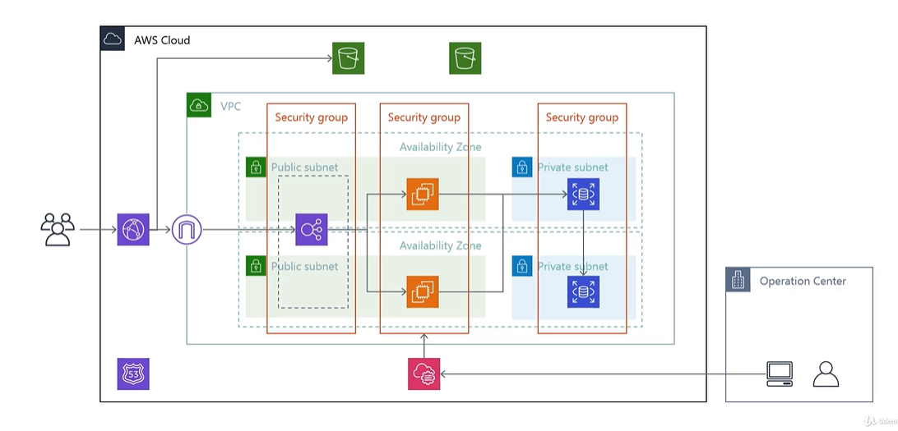

# Terraform AWS Basic Infrastructure (Practice)

## 概要

本リポジトリは、Udemy教材をベースに Terraform を用いて AWS 環境を構築したものです。  
CloudFront、ALB、EC2、RDS などの主要サービスを組み合わせた、標準的な3層Webアプリケーション構成をコードで管理・実装しています。

### 本構成の学習目的
本リポジトリでは、主に以下の技術要素の習得を目的として構築を行っています。

- Terraform による IaC (Infrastructure as Code) 実践
  - AWSリソースのコードによる一元管理と環境構築の自動化
<BR>

- Web配信構成の最適化と理解
  - CloudFront、ALB、S3 を連携させたパスベースルーティングとキャッシュ戦略の実装
<BR>

- セキュアなインフラ設計
  - セキュリティグループによる多層防御（通信制御）の設計
  - IAMロールを用いた「最小権限の原則」に基づくアクセス管理
<BR>

- AWS主要サービスの統合・連携
  - EC2、RDS、ALB、CloudFront を組み合わせた多層アーキテクチャの構築

---
## 構成図


---

## 構成概要

```
User
  ↓
CloudFront（HTTPS）
  ↓
ALB（HTTPS）
  ↓
EC2（AutoScaling）
  ↓
RDS（MySQL）

静的コンテンツ：S3（CloudFront経由のみアクセス可能）
```

---

## 使用サービス

* VPC / Subnet / Route Table
* Internet Gateway
* CloudFront
* Application Load Balancer（ALB）
* EC2（Launch Template + Auto Scaling Group）
* RDS（MySQL）
* S3（静的コンテンツ / デプロイ用）
* Route53
* ACM（東京 / バージニア）
* IAM / Security Group

---

## ネットワーク構成

* VPC: `192.168.0.0/20`
* Public Subnet（2AZ）

  * ALB / EC2配置
* Private Subnet（2AZ）

  * RDS配置
* Internet Gateway により Public Subnet のみ外部通信可能

---

## ドメイン構成

* CloudFront: `dev.${var.domain}`
* ALB: `dev-elb.${var.domain}`

---

## HTTPS構成

* CloudFront → ACM（us-east-1）

* ALB → ACM（ap-northeast-1）

* HTTPアクセスはHTTPSへリダイレクト

---

## CloudFront設計

* 動的コンテンツ (ALB経由)
  * キャッシュ設定: 有効（短時間キャッシュ）
  * TTL設定: Default 60s / Max 300s
  * 用途: アプリケーションの動的レスポンスを一時的に保持
  <BR>
* 静的コンテンツ（S3経由）
  * パス: /public/*
  * キャッシュ設定: 有効
  * セキュリティ: OAC (Origin Access Control) により、S3への直接アクセスを制限し、  
  CloudFront経由の閲覧のみを許可

---

## S3構成

### static bucket

* CloudFront配信用
* Public Access Block 有効
* OAI経由のみアクセス許可

### deploy bucket

* EC2用プライベートバケット
* IAMロールからのみアクセス許可

---

## セキュリティ設計

* ALB → EC2 のみ通信許可

* EC2 → RDS のみ通信許可

* セキュリティグループ連鎖による最小権限構成

* 管理アクセスは制限CIDRによるSSH接続を想定

※ 本構成では SSM(Session Manager) による接続は未実装

---

## IAM設計

* EC2にIAMロールを付与
* S3アクセスは必要最小限に制限

---

## 変数管理

主な変数は以下で管理しています。

* `project`
* `environment`（dev / stg / prod）
* `domain`
* `aws_region`
* `allowed_admin_cidr`

---

## Provider構成

* メインリージョン: ap-northeast-1（東京）
* CloudFront / ACM用: us-east-1（バージニア）

```hcl
provider "aws" {
  region = var.aws_region
}

provider "aws" {
  alias  = "virginia"
  region = "us-east-1"
}
```

---

## 起動方法

```bash
terraform init
terraform plan
terraform apply
```

---

## 補足

* 本リポジトリは学習目的で作成しており、本番利用は想定していません。
* 動的コンテンツについても、学習の一環としてCloudFrontでのキャッシュ挙動を確認するため、短時間のキャッシュ時間を設定しています。
* 静的コンテンツ(`/public/*`)はS3をオリジンとし、キャッシュを有効化しています。
* AMIは学習環境で作成したカスタムAMI（`tastylog-*-ami`）を参照しています。